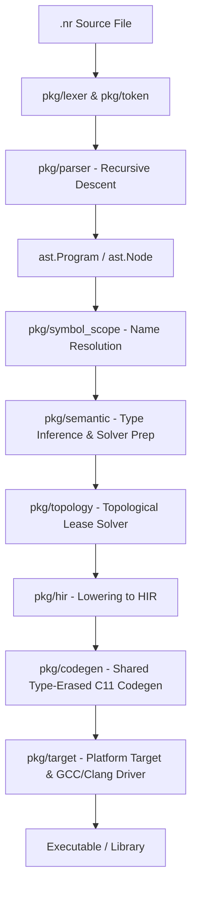

# Nora Language Development Guidelines & Compiler Rules (GEMINI.md)

## Purpose and Core Philosophy

This repository implements the **Nora Programming Language**—a strictly typed, high-performance systems language designed to replace C++, Rust, and Go. Nora achieves compile-time memory safety without a garbage collector and data-race free concurrency without lock overhead by combining a static **Topological Lease Solver** with **Contextual Lifecycle leases**.

Our primary project directive is:
> Correctness, language consistency, and compiler maintainability are far more important than implementation speed.

---

## 1. Compiler Architecture & Pipeline

Any developer introducing changes or debugging the compiler must understand Nora's end-to-end multi-pass pipeline:



Never skip checking how a compiler frontend change affects downstream phases, especially **AST Lowering**, **Lease Solving**, and the **LSP Server** (`pkg/lsp`).

---

## 2. Technical Core Pillars & Subsystems

To keep the compiler robust and maintainable, all contributions must adhere to the design rules of Nora's core subsystems:

### A. The Topological Lease Solver (`pkg/topology`)
* **Purpose**: The static analysis brain. It tracks variable lifetimes using a dependency graph (dependent vs provider) to insert automatic resource release calls.
* **Variable Birth & Lifecycle**: Tracks variable births, assignments, re-assignments, moves (consumptions), and pins (anchoring to the end of blocks).
* **RAII Drop Insertion**: Automatically inserts `PreDrops`, `Drops`, and `TryDrops` (for try/unwrap error paths) inside block statements.
* **Partial/Field Moves**: Tracks nested selector expressions (e.g., `user.profile.name`) to prevent usage of partially moved objects.
* **Rules**:
  1. Never alter the SSA flow without updating `solver.go`'s dependency tracking and lifecycle maps (`localLifecycles` and `allVisible`).
  2. Double-check that re-assignments trigger correct `PreDrops` of the old value before overwriting it, unless the old value is used in the RHS.

### B. AST to HIR Lowering (`pkg/hir`)
* **Purpose**: Before generating code, Nora lowers the AST into a linear High-level Intermediate Representation (HIR).
* **Instructions**: Consists of structured instructions including `Alloca`, `Store`, `Load`, `AddressOf`, `Deref`, `Call`, `VariantConstructor`, `Alloc`, `FieldAccess`, `IndexAccess`, `Cast`, `BinOp`, `UnOp`, `Try`, `InterfaceCast`, `InterfaceCall`, `Spawn`, and `Drop`.
* **Rules**:
  1. HIR instructions must remain target-agnostic.
  2. All memory allocations must go through explicit `Alloc` or `Spawn` HIR nodes to ensure accurate RAII code-generation.

### C. Type-Erased Shared Monomorphization (`pkg/codegen`)
* **Purpose**: A critical compiler optimization. Generating distinct code for every generic type instantiation causes massive binary bloat and slow compilation times.
* **Mechanism**: 
  * If a generic struct, sum type, or function is instantiated with only pointer-like arguments (e.g., `ptr`, `str`, channel types, or nested pointer types), Nora merges them into a single, shared, pointer-erased implementation (using `_ptr` or `_ptr_make` suffixes).
  * Only when types contain different value layout configurations (e.g., primitive integers, floating points) are concrete monomorphized variants created.
* **Rules**:
  1. The code generator (`hir_codegen.go` and `generator.go`) must enforce type erasure via `eraseType()` when collecting definitions.
  2. Any new collection type or generic utility in the standard library (`std/`) must be designed to maximize shared type-erased compatibility.

### D. Cooperative Fiber Runtime (`std/runtime`)
* **Purpose**: Light-weight, stackless concurrency scheduling. Nora maps thousands of fibers onto M:N OS threads.
* **Fibers & Scheduler**: Implements fibers using platform-specific APIs (`CreateFiber`/`DeleteFiber` on Windows, `ucontext` on POSIX, `wasm_cont` on WASM).
* **Cooperative Yields**: Inserts `NR_COOPERATIVE_YIELD_CHECKPOINT()` macro check-points inside generated function prologues.
* **Zero-Copy Channels**: Channel data moves are compiled to zero-copy pointer lease transfers (8 bytes) to maximize performance.
* **Rules**:
  1. All fiber runtime structures and scheduler states (`terminated_fibers`) must be cleanly sweepable by `scheduler_cleanup()` to prevent OS thread/handle leaks.

---

## 3. Real Nora Language Syntax Guidelines

The official and active syntax rules of the **Nora Programming Language** (`.nr`) are defined below. Developers and models must adhere strictly to these rules:

### A. Core Memory & Lease Operators
Nora uses explicit markers for ownership, moves, and borrowing to allow the compiler to build the topological dependency graph:
* **Owned Move (`@`)**: Used to represent the ownership transfer (consumption) of a value or variable.
  * E.g., `new_data[i] = @v.data[i]` transfers ownership from the source index to the destination.
  * Structural definitions: `pub type Vector[T] = struct { data: @T[], ... }` defines a struct field that holds owned elements.
* **Read-Only Borrow (`#`)**: Represents a read-only lease (immutable borrow).
  * E.g., `f(#v.data[i])` takes a read-only lease of the element.
  * Method Receiver: `pub fn (v: #Vector[T]) Len[T]() i32` receives a read-only borrow of the Vector.
  * Struct field: `vec: #Vector[T]` stores a read-only lease.
* **Mutable Borrow (`&`)**: Represents a mutable lease (read-write exclusive borrow).
  * E.g., `pub fn (v: &Vector[T]) Push[T](val: T)` receives a mutable lease to modify the Vector.

### B. Generics Syntax
* Generics use **square brackets `[T]`** instead of angle brackets.
  * Defining structs: `pub type Vector[T] = struct { ... }`
  * Defining functions: `pub fn NewVector[T](cap: i32) @Vector[T]`
  * Defining receiver methods: `pub fn (v: &Vector[T]) Push[T](val: T)`
  * Generic Option pattern: `Some[#T](val)`, `None[#T]`

### C. Explicit Allocation Keyword
* Memory allocation on stack/heap must go through the **`alloc`** keyword:
  * E.g., `return alloc Vector[T] { ... }`
  * E.g., `data: alloc T[c]` (allocates a slice of type `T` with capacity `c`).

---

## 4. Compiler CLI Commands & Configurations

All command line workflows in Nora are managed through the main entrypoint (`pkg/cmd/nora/main.go`).

### A. Primary CLI Commands
* `Nora init [--lib | -l] <project-name>`: Initializes an executable or library workspace.
  * Library initializations automatically generate `src/lib.nr` and a runnable example under `examples/basic.nr` to provide a premium developer experience (DX).
* `Nora build [flags] [filename]`: Compiles Nora code to C11 and triggers native compilers (GCC/Clang/CL).
* `Nora run [flags] [filename]`: Builds and immediately executes the target binary.
* `Nora test`: Runs integration tests.
* `Nora fmt`: Formats codebase files via `pkg/format`.
* `Nora lsp`: Starts the Language Server Protocol process.

### B. Compilation Flags
* `--example <name>`: Builds/runs a specific project example located in `examples/`.
* `-r`, `--release`: Compile in optimized release mode.
* `-d`, `--debug`: Compile in debug mode with local diagnostic info.
* `--debug-memory`: Activates memory leak checks (`nr_mem_report()`) in generated C binaries.
* `-g`: Enables source-mapping and C-level debug symbols.
* `--target`: Specify cross-compilation targets (e.g., `windows-amd64`, `wasm`, `wasi`).
* `--verbose`: Show detailed compilation stages, commands, and GCC compile steps.

### C. The Project Manifest (`nora.yaml`)
Project manifests utilize the YAML specification (not `.mod` files). The structure includes:
```yaml
name: my_project
version: 1.0.0
language: 0.1.0
entry: src/main.nr
output: my_project_bin
plugins: []
dependencies:
  my_lib:
    path: ../my_lib/src
    version: 1.0.0
native:
  compiler: clang
  cflags: ["-pthread"]
  headers: ["my_header.h"]
  source_files: ["my_c_implementation.c"]
```

---

## 5. Integration Testing Suite (`Nora test`)

Integration tests are executed using `Nora test` against files inside the `pkg/cmd/test/` directory.

### A. Positive vs. Negative Tests
* **Negative Tests**: Files starting with `fail_` or containing `violation` in their filenames are expected to fail during parsing, semantic analysis, or topological lease solving. The test runner passes them *if* they emit diagnostic errors.
* **Positive Tests**: Standard `.nr` files inside `pkg/cmd/test/` must pass parsing, type-checking, lease solving, and C-compilation without emitting compiler diagnostics.

### B. Infrastructure Memory Leaks
Fibers and concurrent workloads might trigger standard 16-byte infrastructure leaks inside integration tests. The test runner explicitly parses and filters these out using:
`Ignoring known infrastructure leak in: <test_name>`

---

## 6. Documentation First

Before writing any non-trivial compiler feature or introducing syntax changes, you must document it. No markdown files should be created outside these directories under [docs/](file:///e:/Project/Project%20Chronos/second/docs/):

```text
docs/
├── adr/             # Architecture Decision Records for major design choices
├── investigations/  # Detailed post-mortems of complex bugs and compiler failures
├── plans/           # Feature and refactoring implementation plans
├── specifications/  # Official Nora language specification files
├── roadmap/         # Timeline planning docs
├── walkthroughs/    # Documentation of completed implementations
└── reports/         # Analysis and profiling results
```

### A. Specifications (`docs/specifications/`)
Every language feature must have an official specification before implementation.
Required Sections: **Title & Overview**, **Motivation**, **Syntax**, **Semantics**, **Type Rules**, **Lease Rules**, **Examples**, **Edge Cases**, **Errors & Diagnostics**, **Future Considerations**.

### B. Implementation Plans (`docs/plans/`)
Required Sections: **Title**, **Status**, **Metadata**, **Goal**, **Affected Compiler Components**, **Implementation Checklist**, **Test Plan**, **Risks**, **Completion Criteria**.

### C. Architecture Decision Records (`docs/adr/`)
Required Sections: **Status**, **Context**, **Decision**, **Alternatives Considered**, **Consequences**.

### D. Compiler Investigations (`docs/investigations/`)
Every complex bug, memory leak, or compiler crash must be documented.
Required Sections: **Problem**, **Reproduction**, **Root Cause**, **Fix**, **Validation**.

---

## 7. Language Design Principles & Priorities

Resolve all implementation trade-offs using the following strict priority hierarchy:

1. **Language Consistency**: The language must feel unified; patterns must compose predictably.
2. **User Simplicity**: Syntactic constructs must remain clean, minimal, and clear of noise.
3. **Predictability**: Code must do exactly what it says. No hidden allocations, no silent memory copies, no invisible concurrency overhead.
4. **Compiler Maintainability**: Keep the Go-based compiler frontend and SSA solver modular, readable, and highly commented.
5. **Runtime Performance**: Optimize the emitted C11 code, stackless fibers, and zero-copy channel transfers.
6. **Compilation Speed**: Leverage metadata caching (`.Norai` files) to ensure incremental compilation stays blazing fast.

---

## 8. Testing & Quality Assurance Rules

We maintain a zero-tolerance policy for untested compiler features or unvalidated bug fixes.

* **Every language feature** requires:
  * **Positive Tests**: Verifying that correct code parses, type-checks, solves leases, and executes successfully with expected output.
  * **Negative Tests**: Verifying that incorrect code fails compilation gracefully with highly informative, diagnostic messages (`pkg/diag`).
  * **Edge Case Tests**: Zero-value boundary checks, scope shadowing, and lease lifetime limits.
* **Every bug fix** requires:
  1. Creating a regression test mimicking the failure.
  2. Verifying the regression test fails on the old compiler.
  3. Verifying the regression test passes after applying the fix.

---

## 9. Completion & Merge Criteria

Before marking work as completed or submitting a pull request:

1. **Specification** exists or has been updated under `docs/specifications/`.
2. **Implementation Plan** is fully updated and marked `Status: Completed`.
3. **Architecture Decisions** (if any) are documented in an accepted `docs/adr/`.
4. **Full Test Suite passes** (including newly added positive, negative, and regression tests).
5. **Formatting** is verified using the formatter (`pkg/format`).
6. **Walkthrough** is written/updated under `docs/walkthroughs/` to summarize the changes for the team.
