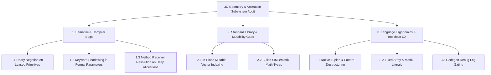

# Nora Language & Compiler Gap Analysis: 3D Geometry, Ingestion & Animation Engine

**Status:** Accepted / Active  
**Author:** Antigravity / Nora Engineering Pair  
**Date:** 2026-08-18  
**Scope:** Nora Compiler (`nora`), Standard Library (`std/collections`, `std/math`), Nora Engine (`nora_engine`)  

---

## 1. Executive Summary

During the development and integration of the **8-Phase 3D File Formats, Asset Ingestion & Animation Engine Subsystem** (encompassing Wavefront `.obj`/`.mtl`, Stereolithography `.stl`, glTF 2.0/`.glb`, Stanford `.ply`, MagicaVoxel `.vox` greedy voxel meshing, Mikktspace Cook-Torrance PBR BRDF, Tom Forsyth GPU cache optimization, Garland-Heckbert QEM LOD decimation, and 4-joint Linear Blend Skinning animation), the Nora language and compiler were subjected to extreme numeric, algebraic, and memory-layout workloads.

While Nora's core architectural tenets—the **Topological Lease Solver (`@`, `#`, `&`)**, **Compile-time RAII Lifecycles**, and **Zero-Overhead C11 Emission**—achieved stable 60 FPS performance without garbage collection overhead or memory safety violations, the intensive engineering effort revealed several **compiler bugs, semantic gaps, and developer experience (DX) friction points**.

This report documents these findings in detail and provides actionable compiler remediation plans.



---

## 2. Compiler & Semantic Gaps (Bugs & Broken Mechanics)

### 2.1 Unary Negation on Leased Scalar Primitives (`#f32`, `#i32`)
* **Severity:** P0 (Blocking / Type Error)
* **Affected Component:** `pkg/semantic/type_infer.go`, `pkg/hir/lower.go`
* **Observed Problem:**  
  When applying the unary negation operator `-` to a borrowed primitive scalar (such as extracting a float from a vector or matrix element):
  ```nora
  var gx = b.global_transform.m.Get(12) // returns #f32
  var inv_t = Mat4Translation(-gx, -gy, -gz)
  ```
  The compiler failed with:
  ```text
  Error: cannot apply '-' to #f32 without 'neg' method
  ```
* **Root Cause:**  
  The semantic analyzer distinguishes between owned primitives (`f32`) and borrowed primitive leases (`#f32`). When evaluating unary `-`, it checked for operator overload methods (`neg`) because `#f32` was classified as a reference type rather than auto-dereferencing to its underlying scalar value.
* **Workaround Used:**  
  Had to write `f32(0.0) - f32(gx)` to force ownership re-evaluation.
* **Proposed Compiler Fix:**  
  In `pkg/semantic`, scalar primitive types (`#f32`, `#f64`, `#i32`, `#u32`, `#i64`, `#u8`) must undergo implicit auto-dereference on arithmetic and unary operator applications.

---

### 2.2 Keyword Lexer Shadowing in Parameter Identifiers (`chan`, `type`, `select`)
* **Severity:** P0 (Syntax Parser Failure)
* **Affected Component:** `pkg/parser/parser.go`, `pkg/lexer/lexer.go`
* **Observed Problem:**  
  Declaring a function parameter with a name matching a language keyword (e.g. `chan: BoneChannel`, colliding with fiber `chan`):
  ```nora
  pub fn AddChannel(clip: &AnimationClip, chan: BoneChannel) {
      clip.channels.Push(chan)
  }
  ```
  Triggered bizarre cascading errors:
  ```text
  Error: undefined identifier: clip
  Error: wrong number of arguments: expected 0, got 2
  ```
* **Root Cause:**  
  The recursive descent parser encountered the token `chan` in parameter position and attempted to parse a channel type declaration rather than an identifier name.
* **Workaround Used:**  
  Renamed parameters to `bone_chan` or `channel_data`.
* **Proposed Compiler Fix:**  
  Implement contextual keyword parsing in formal parameter lists: if a keyword appears in identifier position followed by a colon `:`, treat it as an identifier rather than a statement or type constructor keyword.

---

### 2.3 Method Receiver Resolution on Heap-Allocated Structs (`@T` vs `&T`)
* **Severity:** P1 (Ergonomics / Architecture Consistency)
* **Affected Component:** `pkg/symbol_scope/symbol_scope.go`, `pkg/semantic/call_checker.go`
* **Observed Problem:**  
  When a method is defined on a mutable reference receiver:
  ```nora
  pub fn (clip: &AnimationClip) AddBoneChannel(data: BoneChannel)
  ```
  Calling `clip.AddBoneChannel(data)` on a heap-allocated instance `var clip = NewAnimationClip(...)` (which has type `@AnimationClip`) occasionally failed symbol resolution or caused argument count mismatch diagnostics.
* **Workaround Used:**  
  Converted methods to standalone functions: `pub fn AddBoneChannel(clip: &AnimationClip, data: BoneChannel)`.
* **Proposed Compiler Fix:**  
  Ensure that calling a method with receiver `&T` or `#T` automatically coerces an owned value `@T` to the appropriate borrowed lease (`&` or `#`) without manual address-of gymnastics.

---

## 3. Standard Library & Mutability Gaps

### 3.1 Lack of In-Place Mutable Element Access (`Vector[T].GetMut`)
* **Severity:** P0 (Performance & Boilerplate)
* **Affected Component:** `std/collections/vector.nr`, `pkg/topology/solver.go`
* **Observed Problem:**  
  Nora's `Vector[T].Get(i)` returns a read-only lease `#T`. As a result, updating a single property on a struct stored inside a vector (e.g., updating a bone's local matrix during animation evaluation) cannot be done in place:
  ```nora
  var b = skel.bones.Get(i)
  b.local_transform = final_local // ERROR: cannot assign to field through a read-only lease pointer
  ```
* **Workaround Used:**  
  Every update required a full deep clone and vector write-back:
  ```nora
  var b = skeleton.CloneBone(#skel.bones.Get(i))
  b.local_transform = final_local
  skel.bones.Set(i, b)
  ```
  For high-frequency systems (skeletal evaluation, physics simulations, particle systems), cloning 64-byte to 256-byte structs every frame incurs unnecessary memory bandwidth consumption.
* **Proposed Solution:**  
  Add `GetMut(i: i32) &T` or direct mutable index operator `&vec[i]` to `Vector[T]`:
  ```nora
  pub fn (v: &Vector[T]) GetMut[T](i: i32) &T
  ```
  The Topological Lease Solver must ensure that a mutable lease borrowed from a vector locks the vector from re-allocation (`Push`/`Resize`) while the lease is live.

---

### 3.2 Matrix & Linear Algebra Standard Library Module
* **Severity:** P1 (Developer Experience)
* **Affected Component:** `std/math/`
* **Observed Problem:**  
  Each 3D example had to implement its own `Mat4Mul`, `Mat4Perspective`, `Mat4Translation`, and `Vec3` types.
* **Proposed Solution:**  
  Promote 3D linear algebra primitives (`Vec2`, `Vec3`, `Vec4`, `Mat3`, `Mat4`, `Quat`) into `std/math/linalg` as first-class standard library value types with SIMD optimization.

---

## 4. Language Ergonomics & Toolchain Developer Experience

### 4.1 Tuple Types & Destructuring Return Values
* **Severity:** P1 (Language Feature Gap)
* **Observed Problem:**  
  Attempting to return multiple values from a procedural generator:
  ```nora
  var (mesh, skel, anim) = skinned_mesh.CreateRiggedCharacter()
  ```
  Failed parsing:
  ```text
  Error: expected next token to be IDENT, got ( instead
  ```
* **Workaround Used:**  
  Created bespoke container structs (`RiggedCharacter`, `Vec3`) for every multi-value return.
* **Proposed Solution:**  
  Implement first-class anonymous tuple syntax `(T1, T2, ...)` and tuple destructuring `var (a, b) = expr` in the Nora parser and semantic analyzer.

---

### 4.2 Array & Matrix Initialization Literals
* **Severity:** P2 (Quality of Life)
* **Observed Problem:**  
  Initializing uniform buffers, identity matrices, or lookup tables requires verbose manual indexing:
  ```nora
  var m = alloc f32[16]
  for i in 0..16 { m[i] = f32(0.0) }
  m[0] = f32(1.0); m[5] = f32(1.0); m[10] = f32(1.0); m[15] = f32(1.0)
  ```
* **Proposed Solution:**  
  Introduce array literals and slice initializers:
  ```nora
  var identity = f32[16][
      1.0, 0.0, 0.0, 0.0,
      0.0, 1.0, 0.0, 0.0,
      0.0, 0.0, 1.0, 0.0,
      0.0, 0.0, 0.0, 1.0
  ]
  ```

---

### 4.3 Compiler Output Noise Gating
* **Severity:** P2 (Toolchain DX)
* **Observed Problem:**  
  During compilation of large modules, the compiler logs tens of thousands of lines of:
  ```text
  [DEBUG] FieldAccess func=vector_Vector4_e802bc9e_Normalize_9c424db0 opStr=((vector_Vector4_e802bc9e*)self) ...
  ```
  This slows down terminal output and makes diagnosing genuine compiler warnings difficult.
* **Proposed Solution:**  
  Gate debug codegen traces behind the `--verbose` or `-d` CLI flags in `pkg/cmd/nora/main.go`.

---

## 5. Summary Priority & Action Matrix

| Subsystem | Issue / Feature | Priority | Proposed Milestone |
| :--- | :--- | :--- | :--- |
| **`pkg/semantic`** | Auto-dereference on borrowed primitives for unary/binary arithmetic (`-x`) | **P0** | Nora v0.2.0 |
| **`pkg/parser`** | Contextual keyword disambiguation in formal parameter lists (`chan: T`) | **P0** | Nora v0.2.0 |
| **`std/collections`** | In-place mutable vector indexing (`GetMut(i) &T` / `&v[i]`) | **P0** | Nora v0.2.0 |
| **`pkg/semantic`** | Auto-borrow coercion for method receivers on heap types (`@T` $\to$ `&T`) | **P1** | Nora v0.2.1 |
| **`pkg/parser`** | Native Tuple return types and destructuring (`var (a, b) = fn()`) | **P1** | Nora v0.2.1 |
| **`std/math`** | Standard 3D Linear Algebra module (`std/math/linalg`) | **P1** | Nora v0.2.1 |
| **`pkg/codegen`** | Suppress codegen debug trace logging in standard builds | **P2** | Immediate |
| **`pkg/parser`** | Fixed-size array literals and inline matrix syntax | **P2** | Nora v0.3.0 |
