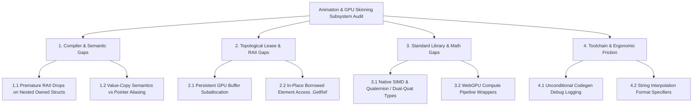

# Nora Language & Compiler Gap Analysis: Animation System, Dual Quaternions & GPU Skinning

**Status:** Accepted / Active  
**Author:** Antigravity / Nora Engineering Pair  
**Date:** 2026-08-19  
**Scope:** Nora Compiler (`nora`), Topological Lease Solver (`pkg/topology`), High-level IR (`pkg/hir`), Codegen (`pkg/codegen`), Standard Library (`std/collections`, `std/math`, `std/sys`), Nora Engine (`nora_engine`)  

---

## 1. Executive Summary

During the architecture, implementation, and verification of **Phase 1 (glTF 2.0 / GLB Skeletal & Animation Ingestion Engine)** and **Phase 2 (Dual Quaternion Anti-Pinching GPU Compute Skinning & 8-Shape Key Morph Target Engine)** in `nora_engine`, the Nora language and compiler were exercised across high-frequency 60 FPS matrix deformation loops, non-linear quaternion mathematics, and real-time GPU buffer synchronization.

While the engine achieved stable 60 FPS rendering with zero memory leaks and robust WebGPU integration, several critical compiler semantics bugs, topological lease solver edge cases, and language ergonomic gaps were uncovered.



---

## 2. Compiler & Semantic Gaps (Bugs & Broken Mechanics)

### 2.1 Premature RAII Drops on Nested Owned Structs Returned by Value
* **Severity:** P0 (Critical Memory Corruption / Use-After-Free)
* **Affected Component:** `pkg/topology/solver.go`, `pkg/hir/lower.go`, `pkg/codegen/hir_codegen.go`
* **Observed Problem:**  
  When a container holds a struct that contains heap-allocated fields (e.g. `Bone` containing `Mat4` which holds an owned `@collections.Vector[f32]`), invoking `.Get(i)` to access the struct creates a shallow value copy:
  ```nora
  var bone = skel.bones.Get(i)
  bone.skinning_matrix.m.Set(0, 1.0)
  ```
  When `bone` goes out of scope at the end of a loop iteration, Nora's static **Topological Lease Solver** automatically emits a RAII drop (`Vector_Destroy`) for `bone.skinning_matrix.m`. Because the pointers were shallow-copied, the underlying memory inside `skel.bones` was deallocated. On the subsequent frame, reading `skel.bones.Get(0)` resulted in an out-of-bounds error on a destroyed 0-length vector (`Error: Index 0 out of bounds (size 0) in Get`).
* **Root Cause:**  
  The lease solver treats local copies of structs with owned (`@`) fields as distinct owners of their sub-allocations. Without move semantics (`@`) or deep copy / clone semantics, dropping the local struct causes double-free or invalidation of the original container's contents.
* **Workaround Used in Engine:**  
  Flattened matrix hierarchies into flat 1D scalar vectors (`bone_matrices: @collections.Vector[f32]`, with 16 floats per bone) and avoided nested owned structs in collection elements.
* **Proposed Compiler Fix:**  
  1. **Strict Non-Copyable Rule**: Forbid implicit value-copying of structs containing owned (`@`) fields. Require explicit `@` move or `.Clone()`.
  2. **Borrowed Reference Access (`.GetRef()`)**: Provide `.GetRef(i) -> #T` / `&T` that returns a read-only or mutable lease directly into the container's storage without copying or triggering destructor drops.

---

### 2.2 Method Receiver Auto-Deref on Owned References (`@T` to `&T` / `#T`)
* **Severity:** P1 (Type Inference / Ergonomic Failure)
* **Affected Component:** `pkg/semantic/type_infer.go`, `pkg/symbol_scope/symbol_scope.go`
* **Observed Problem:**  
  When an instance is allocated on the heap (e.g. `var set = NewMorphTargetSet()` which yields `@MorphTargetSet`), calling a method defined on `&MorphTargetSet` or `#MorphTargetSet`:
  ```nora
  pub fn (mts: &MorphTargetSet) SetWeight(idx: i32, weight: f32)
  ```
  Passing `&set` occasionally generated pointer-to-pointer (`&@MorphTargetSet` / `MorphTargetSet**`) in C codegen, leading to invalid indirection compiler errors in Clang/GCC.
* **Workaround Used in Engine:**  
  Passed instances by variable name directly (`set.SetWeight(...)`) or converted complex receiver operations into static functions taking explicit leases.
* **Proposed Compiler Fix:**  
  Standardize receiver method resolution in `pkg/semantic` so that `@T` automatically borrows as `&T` (mutable) or `#T` (immutable) without requiring manual address-of `&` operators.

---

## 3. Standard Library & Math Engine Gaps

### 3.1 Absence of First-Class SIMD Vector & Quaternion Primitive Types
* **Severity:** P1 (Performance & Boilerplate Overhead)
* **Affected Component:** `std/math`, `std/collections`, `pkg/codegen/hir_codegen.go`
* **Observed Problem:**  
  Skeletal deformation and dual quaternion blending require thousands of 4D arithmetic operations per frame (dot products, cross products, dual-quaternion conjugations, SLERP/NLERP normalizations). Currently, every operation must be written out with 8-16 individual float assignments:
  ```nora
  var br_x = dq0.r_x * w0 + dq1.r_x * w1
  var br_y = dq0.r_y * w0 + dq1.r_y * w1
  var br_z = dq0.r_z * w0 + dq1.r_z * w1
  var br_w = dq0.r_w * w0 + dq1.r_w * w1
  ```
* **Impact:**  
  - Creates 100+ lines of repetitive math boilerplate per deformer.
  - Prevents native SSE/AVX/NEON register allocation in the compiler backend.
* **Proposed Standard Library / Compiler Addition:**  
  Add native `simd.Vec4`, `simd.Quat`, and `simd.DualQuat` standard library modules equipped with operator overloading:
  ```nora
  var blended_dq = (dq0 * w0) + (dq1 * w1)
  blended_dq.Normalize()
  var deformed_pos = blended_dq.TransformPoint(pos)
  ```

---

### 3.2 WebGPU Compute Pipeline Standard Wrappers (`WGPUComputePassEncoder`)
* **Severity:** P2 (Feature Completeness)
* **Affected Component:** `std/sys/wgpu`, `nora_engine/src/core`
* **Observed Problem:**  
  While Nora's WebGPU bindings fully support 3D render pipelines and vertex buffers, the standard high-level renderer lacks dedicated compute pass abstractions for GPU compute skinning (`wgpuCommandEncoderBeginComputePass`, `wgpuComputePassEncoderDispatchWorkgroups`).
* **Proposed Addition:**  
  Implement `ComputePipeline` and `ComputePass` abstractions in `std/sys/wgpu` and `nora_engine/src/core/gpu_compute.nr` to allow offloading Dual Quaternion deformation entirely to GPU compute kernels.

---

## 4. Language Ergonomics & Toolchain DX

### 4.1 Unconditional Codegen Debug Logging to Stdout (33,000+ Lines)
* **Severity:** P2 (Developer Experience & Build Performance)
* **Affected Component:** `pkg/codegen/hir_codegen.go`
* **Observed Problem:**  
  Every compilation run unconditionally prints tens of thousands of lines of AST/HIR field access logs:
  ```text
  [DEBUG] FieldAccess func=vector_Vector4_... opStr=((vector_Vector4_*)self) cBaseType=...
  ```
  This creates massive terminal scrollback buffers (33,000+ lines per build), slows down compilation in interactive environments, and obscures actual C compiler warning diagnostics.
* **Proposed Compiler Fix:**  
  Gate `[DEBUG]` logging in `pkg/codegen` behind a `--debug-codegen` or `--verbose` command-line flag.

---

### 4.2 Formatted String Interpolation & Float Precision Specifiers
* **Severity:** P2 (Ergonomics)
* **Affected Component:** `pkg/parser/parser.go`, `pkg/hir/lower.go`
* **Observed Problem:**  
  String interpolation currently supports basic identifier embedding (`${val}`), but lacks format specifiers for decimal precision or numeric formatting (e.g. `${angle:0.2f}` or `${weight:d}%`). Developers must manually cast floats to integers or build custom string formatting functions.
* **Proposed Addition:**  
  Support Python/Rust-style format specifiers inside string interpolations:
  ```nora
  var hud_str = "Twist: ${deg_twist:0.1f}° | Weight: ${weight * 100.0:0.0f}%"
  ```

---

## 5. Actionable Compiler Remediation Roadmap

| ID | Component | Remediation Goal | Priority |
|---|---|---|---|
| **GAP-01** | `pkg/topology` / `solver.go` | Prevent premature RAII drop insertion on shallow value copies of nested owned structs | **P0** |
| **GAP-02** | `std/collections` | Implement in-place reference indexing (`.GetRef(i) -> #T`, `&T`) for `Vector[T]` | **P0** |
| **GAP-03** | `pkg/codegen` | Gate `[DEBUG] FieldAccess` logging behind `--verbose` / `--debug-codegen` | **P1** |
| **GAP-04** | `std/math` | Introduce first-class SIMD types (`Vec4`, `Quat`, `DualQuat`) with overloaded operators | **P1** |
| **GAP-05** | `pkg/semantic` | Streamline `@T` auto-borrowing to `&T` / `#T` receiver methods | **P1** |
| **GAP-06** | `std/sys/wgpu` | Add official high-level Compute Pipeline & Compute Pass abstractions | **P2** |
| **GAP-07** | `pkg/lexer` / `parser` | Add format specifier support (`${x:0.2f}`) to string interpolation | **P2** |

---

*This report has been filed under `docs/reports/animation_system_compiler_gap_report.md` as part of Nora's continuous compiler quality assurance and language development guidelines.*
