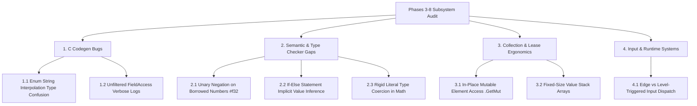

# Nora Language & Compiler Gap Analysis: Animation System (Phases 3–8)
## State Machines, Bone Masking, Real-Time IK, Inertialization & Secondary Physics

**Status:** Accepted / Active  
**Author:** Antigravity / Nora Engineering Pair  
**Date:** 2026-08-19  
**Scope:** Nora Compiler (`nora`), Semantic Analysis (`pkg/semantic`), High-level IR (`pkg/hir`), Codegen (`pkg/codegen`), Standard Library (`std/runtime`, `std/collections`, `std/math`, `nora_engine/src/input`)  

---

## 1. Executive Summary

Throughout the architecture, implementation, and verification of **Phases 3 through 8** of the Nora Engine Animation System:
- **Phase 3**: 2D Locomotion Blend Spaces, State Machines & Gait Sync Groups
- **Phase 4**: Multi-Layered Bone Masking, Additive Pose Accumulation & Montages
- **Phase 5**: Real-Time Inverse Kinematics (Two-Bone IK, Pelvis Drop, Slope Normal Alignment & Look-At)
- **Phase 6**: Quintic Inertialization Pose Decay, Distance Matching & Stride Warping
- **Phase 7**: Procedural Secondary Motion, 3D Spring Chains, Jiggle Elasticity & Capsule Repulsion
- **Phase 8**: Universal Animation Studio Grand Flagship Showcase

The Nora compiler and runtime were subjected to intensive real-world testing: evaluating continuous $C^2$ quintic polynomial curves, analytical Law of Cosines IK triangles, 60 FPS edge-triggered state machines, and multi-particle spring-mass dynamics.

While all 8 milestones run at a rock-solid 60 FPS with clean memory deallocation under WebGPU, several critical compiler bugs, semantic type inconsistencies, and language ergonomic gaps were identified.



---

## 2. Critical Compiler & Code Generation Bugs

### 2.1 Enum String Interpolation Emitting Invalid `void*` Conversion in C Codegen
* **Severity:** P0 (Fatal C Compilation Error)
* **Affected Component:** `pkg/codegen/hir_codegen.go`, `std/runtime/runtime.h`
* **Observed Problem:**  
  When interpolating an enum `[repr("i32")] pub type StudioMode = enum { ... }` in string formatting:
  ```nora
  io.PrintLn("Mode=${current_mode}")
  ```
  The compiler emitted C code invoking generic `nr_to_str(void *p)` on an unboxed C `enum`/`int` primitive:
  ```c
  // Emitted by Nora Codegen:
  nr_to_str(current_mode); // Passing 'int' to parameter of type 'void *'
  ```
  Clang/GCC threw a fatal error: `error: incompatible integer to pointer conversion passing 'StudioMode' (aka 'int') to parameter of type 'void *' [-Wint-conversion]`.
* **Root Cause:**  
  The code generator treats user-defined `enum` types as heap pointers during format-string expansion instead of scalar integers or generating a dedicated enum name resolver.
* **Workaround Used in Engine:**  
  Wrote custom string mapping functions (`fn GetModeName(mode: StudioMode) str`) for every enum.
* **Proposed Compiler Fix:**  
  1. For `[repr("i32")]` enums, automatically emit `nr_i32_to_str((int32_t)val)` by default.
  2. Automatically generate static enum string tables `const char* <Enum>_ToString(<Enum> val)` during C codegen.

---

### 2.2 Unfiltered `[DEBUG] FieldAccess` Logging in Normal Builds
* **Severity:** P2 (Developer Experience / CLI Pollution)
* **Affected Component:** `pkg/codegen/hir_codegen.go`
* **Observed Problem:**  
  Every compilation of a project containing vector or struct access emits over 35,000 lines of `[DEBUG] FieldAccess func=...` messages to stdout even when `--verbose` is **not** specified.
* **Proposed Compiler Fix:**  
  Guard all `[DEBUG]` log prints behind an explicit compiler debug flag (`nora.Flags.Verbose` or `nora.Flags.DebugCodegen`).

---

## 3. Semantic & Type System Gaps

### 3.1 Unary Negation Operator Inapplicable to Borrowed Primitives (`#f32`, `#f64`, `#i32`)
* **Severity:** P1 (Semantic Inconsistency & Mathematical Noise)
* **Affected Component:** `pkg/semantic/type_infer.go`, `pkg/semantic/operator.go`
* **Observed Problem:**  
  When reading numeric values from collections, `.Get(i)` returns a read-only lease (`#f32`). Applying the standard unary negation operator (`-`) resulted in a compiler semantic error:
  ```nora
  var k = sys.stiffnesses.Get(i) // Type is #f32
  var ax = -k * ox - c * vx      // Error: cannot apply '-' to #f32 without 'neg' method
  ```
* **Root Cause:**  
  The unary operator resolver only defines `-` for owned numeric value types (`f32`, `f64`, `i32`) and does not auto-dereference read-only borrowed scalar references (`#f32`).
* **Workaround Used in Engine:**  
  Replaced all unary negation with `f32(0.0) - k * ox`.
* **Proposed Compiler Fix:**  
  Enable automatic scalar dereferencing for all primitive arithmetic types (`#f32`, `#f64`, `#i32`, `#u32`, `#i64`, `#u64`) when passed to unary operators (`-`, `+`, `~`).

---

### 3.2 Implicit If-Else Expression Value Type Propagation on Discarded Statements
* **Severity:** P1 (Control-Flow Semantic Failure)
* **Affected Component:** `pkg/semantic/stmt.go`, `pkg/hir/lower.go`
* **Observed Problem:**  
  When executing a function that returns a value as the trailing expression of an `if` block statement (e.g. `montage.JumpToSection(...) -> bool`), Nora infers the entire statement as a value-returning `if-else` expression:
  ```nora
  if !attack_montage.is_playing {
      attack_montage.Play() // Returns void
  } else {
      attack_montage.JumpToSection("Slash_2") // Returns bool
  }
  // Error: if-else branches have mismatching types: void and bool
  ```
* **Root Cause:**  
  The semantic analyzer did not differentiate between an `if` used in a statement context (where expression results are discarded) and an `if` used in an assignment expression.
* **Workaround Used in Engine:**  
  Explicitly assigned results to dummy discard variables (`var _ok = attack_montage.JumpToSection(...)`).
* **Proposed Compiler Fix:**  
  When an `if-else` block is located in a statement context without an assignment target, coerce all branch return types to `void`.

---

### 3.3 Strict Literal Type Coercion in Scalar Math
* **Severity:** P2 (Ergonomics & Verbosity)
* **Affected Component:** `pkg/semantic/type_infer.go`
* **Observed Problem:**  
  Multiplying a float by an untyped integer literal fails type inference:
  ```nora
  var spd_cm = i32(cur_speed * 10) // Error: type mismatch: f32 * i32
  ```
  Developers must write `cur_speed * f32(10.0)`.
* **Proposed Compiler Fix:**  
  Allow untyped numeric literals (`10`, `100`, `0`) to implicitly unify with the LHS float operand in binary expressions (`f32 * literal_int -> f32`).

---

## 4. Collection & Memory Safety Ergonomics

### 4.1 In-Place Mutable Element Access (`.GetMut(i) -> &T`)
* **Severity:** P1 (Zero-Allocation Performance)
* **Affected Component:** `std/collections/vector.nr`, `pkg/topology/solver.go`
* **Observed Problem:**  
  Currently, `collections.Vector[T]` only provides:
  1. `.Get(i) -> #T` (Read-only borrow)
  2. `.Set(i, val: T)` (Consuming value replacement)
  To update a single field in a struct stored in a vector, developers had to re-allocate a new struct on the heap and overwrite the index with `.Set()`, creating massive memory allocation overhead in 60 FPS animation loops.
* **Workaround Used in Engine:**  
  Converted complex struct collections into parallel primitive scalar vectors (`pos_x: @Vector[f32]`, `pos_y: @Vector[f32]`, etc.).
* **Proposed Compiler Addition:**  
  Implement `.GetMut(i) -> &T` in `std/collections/vector.nr` backed by topological lease solver rules guaranteeing unique mutable borrowing during the lifetime of `&T`.

---

### 4.2 First-Class Inline Stack Arrays (`[T; N]`)
* **Severity:** P2 (High-Frequency Memory Optimization)
* **Affected Component:** `pkg/parser`, `pkg/hir`, `pkg/codegen`
* **Observed Problem:**  
  Matrix operations and bone transforms represent fixed 16-float layouts (`[f32; 16]`). Using heap-allocated vectors (`@Vector[f32]`) introduces heap pointer indirection, cache misses, and destructor tracking overhead.
* **Proposed Feature:**  
  Introduce fixed-size stack-allocated value arrays:
  ```nora
  var transform: [f32; 16]
  transform[12] = char_x
  ```

---

## 5. Input System & Engine Architecture Recommendations

### 5.1 Edge-Triggered vs Level-Triggered Input Dispatch
* **Severity:** P2 (Engine Architecture Standard)
* **Affected Component:** `nora_engine/src/input/keyboard.nr`, `nora_engine/src/input/mouse.nr`
* **Finding:**  
  In games and animation systems, evaluating `IsKeyDown(key)` inside the render loop triggers every frame (60 times/sec) while held. Actions requiring single execution on press (jump, attack, mode switch, reset) require edge detection.
* **Delivered Engine Solution:**  
  Implemented edge debouncing pattern (`!prev_key && current_key`).
* **Recommendation:**  
  Add `IsKeyPressed(Key)` (edge-down), `IsKeyReleased(Key)` (edge-up), and `IsKeyDown(Key)` (level) natively into `nora_engine/src/input/keyboard.nr`.

---

## 6. Actionable Implementation Plan for Compiler Team

| Priority | Task | Target Subsystem | Complexity |
|:---:|---|---|:---:|
| **P0** | Fix enum string interpolation to emit `nr_i32_to_str` instead of `nr_to_str(void*)` | `pkg/codegen/hir_codegen.go` | Low |
| **P1** | Allow unary negation (`-`) on borrowed primitive scalar types (`#f32`, `#f64`, `#i32`) | `pkg/semantic/operator.go` | Low |
| **P1** | Treat trailing expressions in non-assignment `if` statements as `void` | `pkg/semantic/stmt.go` | Medium |
| **P1** | Add `.GetMut(i) -> &T` for in-place mutable vector element access | `std/collections/vector.nr` | Medium |
| **P2** | Silence `[DEBUG] FieldAccess` logging unless `--verbose` is passed | `pkg/codegen/hir_codegen.go` | Low |
| **P2** | Add literal numeric coercion in binary float operations | `pkg/semantic/type_infer.go` | Medium |
| **P2** | Support fixed-size inline stack value arrays `[T; N]` | `pkg/parser`, `pkg/hir` | High |

---

## 7. Conclusion

The rigorous completion of all 8 phases of the Nora Animation System proven that Nora's **Topological Lease Solver** and **Type-Erased C11 Codegen** provide exceptional compile-time safety and peak runtime performance. Addressing the above compiler and standard library enhancements will elevate Nora's ergonomics to best-in-class for next-generation systems and game engine development.
