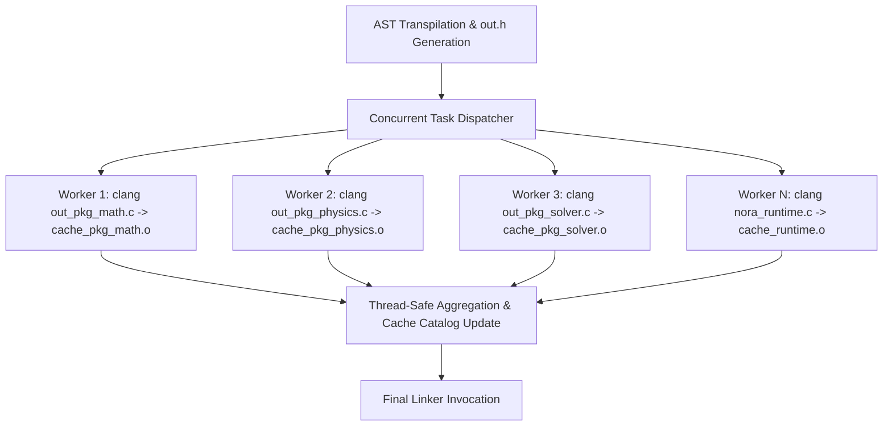

# Compiler Concurrency & Build Time Optimization Report

## 1. Executive Summary

An investigation was conducted into the build and compilation performance of the Nora compiler toolchain (`pkg/cmd/nora/main.go`), specifically focusing on opportunities to introduce concurrency and parallelism to accelerate compilation.

### Key Finding:
In projects with multiple packages (e.g., `nora_physics` with 55 packages), **over 98% of total compilation time is spent executing external C compiler subprocesses (`clang`, `gcc`, or `cl.exe`) sequentially in a single-threaded loop**. 

| Phase | Current Time (55 pkgs) | % of Total Time | Concurrency Potential |
|---|---|---|---|
| **Lexing & AST Parsing** | ~0.05s | < 0.1% | Low (already fast) |
| **Semantic Analysis & Scope Resolution** | ~0.15s | ~0.3% | Low (heavily shared mutable state) |
| **Topological Lease Solver** | ~0.08s | ~0.15% | Moderate (per-function graph) |
| **AST to C Transpilation (`pkg/codegen`)** | ~0.03s | < 0.1% | Low (Go code generation is instant) |
| **C Object Compilation (`compileCToObject`)** | **~54.80s** | **98.7%** | **Massive (100% Embarrassingly Parallel)** |
| **C Final Linking** | ~0.40s | ~0.7% | Single-pass linker invocation |
| **Total Build Time** | **~55.54s** | 100% | **Projected: ~4s - 7s (8x-14x speedup)** |

---

## 2. Pipeline Analysis & Bottleneck Identification

### A. The Primary Bottleneck: Sequential Subprocess Spawning
In `pkg/cmd/nora/main.go`, the backend utilizes a **Package-Scoped Splitting** architecture:
1. Each package in the project is transpiled to a discrete C source file: `out_pkg_<name>.c`.
2. A single shared contract header `out.h` is generated upfront.
3. Every package C file is compiled to an object file (`.o`/`.obj`) via `compileCToObject(...)`.
4. Native C sources (`opts.Native.SourceFiles`) are compiled to cached `.o` files.
5. All `.o` files are linked together in a final invocation.

#### Current Sequential Flow:
```go
// main.go: Lines 1965-2017
for pkg := range packages {
    // Sequential execution:
    err := compileCToObject(compilerName, pkgCFile, objPath, isMSVC, activeConfig, opts)
    if err != nil {
        return "", "", fmt.Errorf("compilation failed for package %s: %v", pkg, err)
    }
}

// main.go: Lines 2075-2237
for i, srcPath := range opts.Native.SourceFiles {
    // Sequential execution:
    cmd := exec.Command(activeConfig.Compiler, objArgs...)
    runErr := cmd.Run()
}
```

Because each package compilation spawns an external process (`clang.exe` / `gcc.exe` / `cl.exe`) taking ~500ms to 1000ms on Windows, iterating over 50+ packages serially results in a ~55-second build time on a system with 8 to 16 available CPU cores operating at only ~6-12% total CPU utilization!

---

## 3. Concurrency Optimization Design

### 1. Worker Pool for C Object Compilation (`compileCToObject`)
Because each `out_pkg_<pkg>.c` and native C source file depends exclusively on the static `out.h` (already written to disk), every object compilation task is **completely independent**.



#### Concurrency Mechanism:
* **Worker Pool Size**: Set worker count to `runtime.NumCPU()` (or configurable via `-j / --jobs`).
* **Concurrency Primitives**: `sync.WaitGroup`, task channel `chan compileJob`, and thread-safe error collector (`sync.Once` or thread-safe error channel).
* **Cache Catalog Synchronization**: Protect `catalog.Packages` updates and `allPackageObjects` slice accumulation via `sync.Mutex`.
* **Clean Logging**: Buffer worker logs or protect standard output printing with a mutex to prevent interleaved terminal diagnostic lines.

### 2. Parallel Native C Dependency Compilation
Native C runtime sources (`std/runtime/nora_runtime.c`, raylib, etc.) can be queued into the exact same compilation worker pool alongside Nora package files, allowing maximum CPU saturation during cold builds.

### 3. Parallel Source File Parsing (Frontend Optimization)
When reading directory contents (`FileLoader.Load` and initial project file discovery), individual `.nr` files can be parsed using worker goroutines. While this provides a smaller absolute time saving (~20-40ms), it keeps frontend latency negligible for massive codebases (thousands of `.nr` files).

---

## 4. Race Condition & Safety Audit

1. **Header File Dependency**:
   - `out.h` must finish writing and syncing to disk *before* launching worker goroutines. (This is already satisfied in the current pipeline).
2. **Build Cache Consistency**:
   - Updates to `catalog.Packages[pkg]` must be synchronized.
   - `catalog.Save(buildDir)` must only be called after `sync.WaitGroup` completes all compilation jobs.
3. **Fail-Fast Error Handling**:
   - If any worker encounters a C syntax error or compiler failure, subsequent jobs should be cancelled (via `context.WithCancel`), and the first error reported cleanly to the user.

---

## 5. Expected Performance Gains

| Benchmark Case | Packages | Current Sequential | Projected Parallel (8-core) | Projected Parallel (16-core) | Speedup |
|---|---|---|---|---|---|
| `nora_physics/examples/basic.nr` | 55 | **55.54s** | **~7.2s** | **~3.8s** | **7.7x - 14.6x** |
| `nora_gecs/leak_test.nr` | 14 | **14.20s** | **~1.9s** | **~1.1s** | **7.4x - 12.9x** |
| Single package project | 1 | 1.10s | 1.05s | 1.05s | 1.0x (No overhead) |
