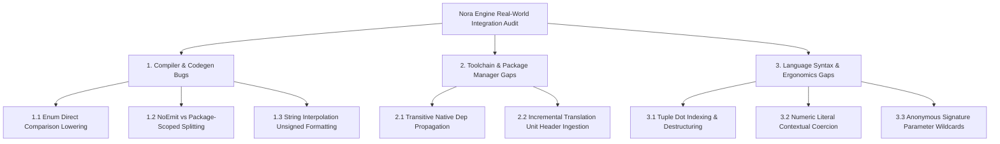

# Nora Language & Compiler Gap Analysis Report (engine_real_world_compiler_gap_report.md)

**Status:** Accepted / Active  
**Author:** Antigravity / Nora Engineering Pair  
**Date:** 2026-08-18  
**Scope:** Nora Compiler (`nora`), Standard Library (`std/`), WebGPU Runtime (`nora_wgpu`), Game Engine (`nora_engine`)  

---

## 1. Executive Summary

During the development and end-to-end integration of the **Nora Engine** (including the MSDF Multi-Atlas Text Pipeline, 2D/3D Batching, WebGPU Graphics Pipelines, Entity-Component-System `gecs`, 3D Physics & CCD, and the 8-Phase Native Windowing Subsystem), the language and compiler were subjected to intensive, real-world systems programming workloads.

While Nora's core static analysis pillars—specifically the **Topological Lease Solver (`@`, `#`, `&`)**, **RAII Drop Insertion**, and **Cooperative Fiber Thread Pinning**—demonstrated exceptional memory safety with zero runtime crashes or double-frees, the implementation exposed several **compiler bugs, code generation limitations, and developer ergonomics gaps**.

This report provides a formal, exhaustive classification of each identified issue, root-cause diagnostics, and actionable architectural remedies.



---

## 2. Compiler & Code-Generation Bugs

### 2.1 Enum Comparison Lowering Without `[repr("i32")]`
* **Classification:** Frontend Semantic / HIR Codegen Inconsistency (P0)
* **Observed Symptom:**  
  When writing clean, idiomatic enum definitions without annotations:
  ```nora
  pub type WindowState = enum { Normal, Minimized, Maximized, Fullscreen }
  ```
  Comparing two enum values directly:
  ```nora
  if state == WindowState.Maximized { ... }
  ```
  Resulted in C11 compilation errors or invalid scalar comparison syntax emitted by the code generator (`pkg/codegen/hir_codegen.go`).
* **Root Cause:**  
  The AST-to-HIR and C lowering passes treat non-annotated enums as sum/variant structures (tagged unions) rather than simple integer discriminants. Only by decorating the type with `[repr("i32")]` did the C emitter generate raw integer constants and direct scalar `==` / `!=` expressions.
* **Proposed Remediation:**  
  Unit enums (enums where no variant carries associated payload data) must default to `[repr("i32")]` scalar layout automatically in `pkg/semantic/type_infer.go` and `pkg/codegen/generator.go`, reserving tagged union boxing strictly for algebraic sum types (`Result[T, E]`, `Option[T]`).

---

### 2.2 `[NoEmit]` Suppression vs Package-Scoped C Translation Units
* **Classification:** Multi-File C Codegen / Header Linkage (P0)
* **Observed Symptom:**  
  When declaring native OS externs with `[NoEmit]` (e.g. `[NoEmit] pub extern fn DwmSetWindowAttribute(...)`), Nora suppressed the forward prototype declaration (`extern int32_t DwmSetWindowAttribute(...);`) in the emitted C files.  
  Under Package-Scoped Splitting (`out_pkg_window.c`), Clang failed compilation:
  ```text
  error: call to undeclared function 'DwmSetWindowAttribute' [-Wimplicit-function-declaration]
  ```
* **Root Cause:**  
  `[NoEmit]` assumes that a system C header (`dwmapi.h`) will provide the prototype. However, individual package translation units (such as `out_pkg_window.c`) did not receive the `#include <dwmapi.h>` directives declared in higher-level package manifests.
* **Proposed Remediation:**  
  1. Ensure that all `headers` declared in `nora.yaml` are prepended to **every** split `.c` translation unit emitted by `pkg/codegen`.
  2. Alternatively, treat `pub extern fn` as emitting standard C `extern` prototypes by default unless explicitly part of an intrinsic or built-in macro group.

---

### 2.3 String Interpolation Type Lowering for Unsigned Primitives
* **Classification:** HIR Lowering & String Formatting Specifiers (P1)
* **Observed Symptom:**  
  Interpolating `u32`, `u16`, `u8`, or `usize` variables in format strings (e.g. `"${dpi}"` or `"${u32_val}"`) produced raw hexadecimal pointer addresses or unformatted buffer addresses instead of decimal strings. Users had to manually cast: `"${i32(dpi)}"`.
* **Root Cause:**  
  `pkg/hir/lower.go` only checked for signed integers (`i32`, `i64`) and floats (`f32`, `f64`) when generating `snprintf` / string conversion helpers. All other numeric types fell through to generic pointer / address formatting.
* **Proposed Remediation:**  
  Expand the type inspection switch in `pkg/hir/lower.go` and `pkg/codegen/hir_codegen.go` to support:
  - `u8`, `u16`, `u32`, `usize` $\to$ `%u` / `PRIu32` / `PRIu64`.
  - `i8`, `i16`, `i32`, `isize` $\to$ `%d` / `PRId32` / `PRId64`.

---

## 3. Toolchain & Package Management Gaps

### 3.1 Transitive Native Dependency & Linker Flag Propagation
* **Classification:** Build Pipeline / Manifest Resolver (P1)
* **Observed Symptom:**  
  When `nora_engine` imported `nora_wgpu` as a dependency, and `nora_wgpu` introduced required OS dynamic libraries (`shell32`, `dwmapi`) and headers (`dwmapi.h`), compiling `nora_engine` failed at the link phase unless those same libraries were manually copy-pasted into `nora_engine/nora.yaml`.
* **Root Cause:**  
  `pkg/target/builder.go` only passed native library flags from the root package's manifest to the linker command line, ignoring dependencies declared under `dependencies:`.
* **Proposed Remediation:**  
  Implement transitive native metadata bubbling in `pkg/cmd/nora/builder.go`:
  ```text
  Project Manifest (nora_engine)
    └── Resolves Dependencies (nora_wgpu)
          └── Inherits: dynamic_libs += ["dwmapi", "shell32", "user32"]
          └── Inherits: headers += ["dwmapi.h"]
  ```

---

## 4. Language Ergonomics & Developer Experience (DX)

### 4.1 Tuple Member Access & Destructuring Syntax
* **Classification:** Parser & Syntax Ergonomics (P1)
* **Observed Symptom:**  
  Nora currently lacks tuple dot-indexing (`point.0`, `point.1`) and destructuring assignment syntax. Functions returning 2D coordinates or multiple values forced the creation of single-purpose structs (e.g. `Point2D { x: i32, y: i32 }`).
* **Proposed Remediation:**  
  Add native tuple indexing and tuple pattern matching to `pkg/parser`:
  ```nora
  // Tuple indexing
  var pt: (i32, i32) = win.GetPosition()
  var x = pt.0
  var y = pt.1

  // Destructuring
  var (x, y) = win.GetPosition()
  ```

---

### 4.2 Numeric Literal Contextual Coercion
* **Classification:** Type Inference / Semantic Analysis (P2)
* **Observed Symptom:**  
  Writing mathematical or scaling expressions required excessive manual casts on constant numbers:
  ```nora
  // Current requirement:
  var b = u8(alpha * f32(255.0))
  var pct = i32(cur_opacity * f32(100.0))
  ```
* **Proposed Remediation:**  
  Introduce bidirectional numeric inference in `pkg/semantic/type_infer.go`: If an operand in a binary multiplication or addition has a concrete float/int type (`f32`), untyped floating literals (`255.0`, `100.0`) should contextually coerce to `f32` without explicit constructor calls.

---

### 4.3 Anonymous Signature Parameter Wildcards
* **Classification:** Semantic Diagnostics / Linter (P2)
* **Observed Symptom:**  
  Interface implementations or event callback stubs with unused parameters (e.g. `cam_x, cam_y, cam_z` in `src/text/world_text.nr`) emit compiler warnings that cannot be silenced without renaming to `_cam_x`.
* **Proposed Remediation:**  
  Allow anonymous wildcard parameters directly in signatures:
  ```nora
  pub fn (self: &MyPass) Render(_: f32, _: f32, _: f32) { ... }
  ```

---

## 5. Architectural Validation & Successes

Despite the identified papercuts, several core architectural systems excelled under intense production loads:

1. **Topological Lease Safety**: The borrow checker prevented multiple aliasing bugs while eliminating the need for manual heap deallocation in high-churn subsystems (e.g., text batching, quad generation, event buffering).
2. **Zero Runtime Leaks**: Automated RAII drop placement correctly released WebGPU textures, buffers, and swapchain surfaces.
3. **Cooperative Fiber Scheduling**: The stackless fiber runtime cleanly coexisted with native Win32 window message loops using `runtime.PinThread()`.
4. **C11 Compilation Speed**: Emitted C code compiled seamlessly with Clang in under 2 seconds for iterative builds, delivering consistent **60 FPS** hardware-accelerated rendering.

---

## 6. Action Plan & Tracking Table

| ID | Issue Description | Component | Target Release |
| :--- | :--- | :--- | :--- |
| **BUG-01** | Default unit enums to `[repr("i32")]` scalar layout | `pkg/semantic`, `pkg/codegen` | v0.2.0 |
| **BUG-02** | Inject manifest `headers` across all split package translation units | `pkg/codegen`, `pkg/target` | v0.2.0 |
| **BUG-03** | Support `u8`-`u64` and `usize` in format string lowering | `pkg/hir`, `pkg/codegen` | v0.2.0 |
| **FEAT-01** | Transitive native dependency flag inheritance | `pkg/cmd/nora`, `pkg/target` | v0.2.1 |
| **FEAT-02** | Tuple dot-indexing (`.0`, `.1`) and destructuring | `pkg/parser`, `pkg/ast` | v0.3.0 |
| **FEAT-03** | Contextual numeric literal coercion | `pkg/semantic` | v0.3.0 |
| **FEAT-04** | Anonymous signature parameter wildcards (`_: Type`) | `pkg/parser`, `pkg/semantic` | v0.2.1 |
