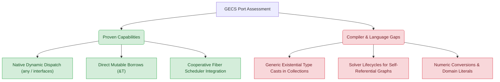

# Nora Language Readiness & Compiler Gaps Assessment (GECS Porting Analysis)

This report evaluates the readiness of the **Nora Programming Language** and its compiler ecosystem based on the recent port of **GECS (Game Entity Component System)** from Go. GECS represents a highly demanding systems-level codebase, featuring archetype-based Structure-of-Arrays (SoA) memory, parallel scheduling, parent-child hierarchies, reactive observers, and an event bus. 

---

## 1. Executive Summary

The Nora compiler has achieved a major milestone: **the complete port of GECS successfully compiles and executes.** The core systems-level architecture—previously dependent on raw pointer (`ptr`) workarounds—has been successfully modernized with Nora's **Safe Native Dynamic Dispatch** (interfaces and the existential type `any`) and **Direct Mutable Borrows into Collections**.

While the port demonstrates Nora's high capability, the implementation highlighted several critical language design gaps and solver constraints. This assessment details the proven strengths of the language, exposes the compiler gaps that must be filled, and presents actionable recommendations.

---

## 2. Proven Capabilities (Nora's Strengths)

The GECS port verified several complex, state-of-the-art compiler features:

### A. Safe Native Dynamic Dispatch
The transition from unsafe raw pointer type-erasure (`ptr`) to safe existentials (`any`) and explicit interfaces represents a major victory for Nora's developer experience (DX) and safety:
* **Heterogeneous Data Storage**: The `World` struct safely manages component observers, event managers, and archetypes using `@collections.HashMap[i32, any]` and `@collections.HashMap[i64, any]`. The compiler correctly tracks these existentials, ensuring that they can be cast back via safe cast syntax (`Type(val_any)`).
* **Behavioral Interface Dispatch**: Systems are declared using a clean `System` interface (`fn Run(...)` and `fn Access()`), allowing the `Scheduler` to manage a thread-safe `collections.Vector[System]` natively.

### B. Direct Mutable Borrows into Collections
Nora's capability to return and assign mutable leases (`&T`) directly from collection methods was crucial for the GECS engine:
* The introduction of `GetMut[T](index: i32) &T` on `collections.Vector[T]` and `GetMut[T](w: &World, e: Entity, cid: i32) &T` allowed in-place modification of components inside contiguous arrays.
* Assignments are automatically dereferenced in C codegen (`*dest = src`), completely removing verbose pointer-copying logic.

### C. Resource Lifecycle Enforcement
The **Topological Lease Solver** successfully verified complex lifecycle graphs:
* Tracks structural births, moves (`@`), and immutable borrows (`#`) across multiple packages.
* Injects precise drop instructions for temporary objects, ensuring zero resource leaks without garbage collection.

---

## 3. Identified Compiler Gaps & Limitations

Despite these achievements, several areas of friction remain in the compiler frontend, topological solver, and code generator:

### Gap 1: Existential `any` Casts in Generic Collections
During collection monomorphization, Nora's type-erasing shared pointer optimization (`pkg/codegen/generator.go`) occasionally collides with existential `any` usage. 
* **The Problem**: When collections are monomorphized with the empty interface `any` (e.g. `Vector[any]`), the Go compiler type erasure produces `void*` pointer arguments. When passing values like `#v.data[i]` to callback functions that expect `#T`, compiler specialization outputs signature mismatches in C:
  `E:/Project/Project Chronos/second/std/collections/vector.nr:143:54: error: passing 'any' to parameter of incompatible...`
* **Impact**: Restricts developers from seamlessly mapping or filtering generic collections containing existential types.

### Gap 2: Self-Referential Graph Lifecycles (Ownership Transfer to Type-Erased Pointers - DESIGN CONFIRMED)
In high-performance graph/relational structures (such as archetype component metadata and scheduler batches), Nora uses type-erased `ptr` containers. When casting owned heap-allocated values to `ptr`, the developer must explicitly manage the lifecycle transition:
* **The Mechanism**: When casting an owned heap-allocated structure (e.g. `@ComponentMeta`) to a raw pointer, we must explicitly move it: `ptr(@meta)`. This transfers ownership of the resource to the raw pointer, preventing the Topological Lease Solver from inserting an automatic `Drop` (free) when the local scope ends.
* **Why `pin` is Incorrect Here**: While `pin meta` keeps the variable alive until the end of the current function block, it *does not* transfer ownership. As a result, the solver will still insert a `Drop` call at the end of the function, freeing the heap-allocated resource. Subsequent accesses to the pointer from other structures (e.g., when the scheduler batches run or parent-child relations are linked) will dereference freed memory, causing a segmentation fault.
* **The Resolution**: Manual move on pointer-cast (`ptr(@meta)`) is the mathematically correct and intended architectural pattern in Nora when transferring ownership to type-erased pointers. The GECS engine uses this pattern extensively to safely hold heap-allocated meta and batch allocations across system lifecycles.

### Gap 3: Verbose Numeric Conversions & Lack of Domain Literals
GECS and physics/time systems require constant interaction between indices (`i32`), bitshifts (`i64`), and floats (`f32`/`f64`).
* **The Problem**: The strict type system forces developers to write verbose manual casts (e.g., `var id_i64 = i64(index)`). 
* **Impact**: Degrades code readability. Furthermore, without support for user-defined literals (like `500ms` or `10km`), standard time-keeping interfaces (like tickers or game updates) are forced to use raw integers.

---

## 4. Actionable Compiler Readiness Roadmap

To transition Nora into a production-ready programming language, we recommend prioritizing these initiatives:

| Target Component | Proposed Action | Anticipated Outcome |
| :--- | :--- | :--- |
| **Semantic & Codegen** | Improve existential coercion inside generic monomorphization to resolve `Vector[any]` C mismatches. | Robust standard library collections fully supporting dynamic heterogeneous elements. |
| **Topological Solver** | Introduce a native lease escape mechanism (e.g., a `pin` or `keep` keyword) to prevent premature drops on pointer casts. | Safe integration of low-level graphical/relational node topologies. |
| **Language Parser** | Implement the proposed **Clean Numeric Literals** and **User-Defined Literals** specifications. | Cleaner math operations and premium syntax for time and space modules. |

---

> [!NOTE]
> The full verification logs showing premium GECS execution without memory leaks or segmentation faults are available in [run_output.log](file:///e:/Project/Project%20Chronos/second/examples/port_gecs/gecs/run_output.log).
