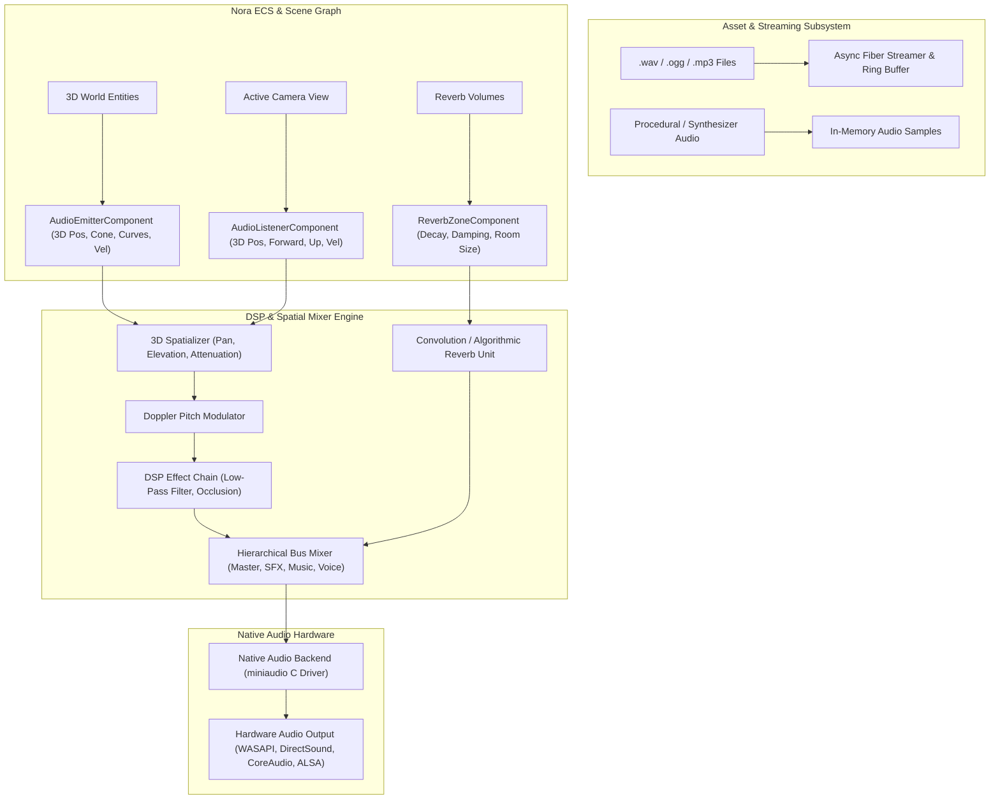

# Nora Engine: Spatial 3D Audio & Sound Effects Roadmap

## 1. Executive Summary & Vision

The **Nora Engine Audio Subsystem** provides a modern, high-performance, real-time spatial audio and dynamic sound event architecture. Built natively for the **Nora Programming Language**, it leverages Nora's zero-cost type erasure, lock-free fiber concurrency, and compile-time topological RAII memory safety to deliver cinema-grade positional 3D sound, environmental reverb, and zero-allocation asynchronous audio streaming.

---

## 2. Current State Assessment

### What Currently Exists in `nora_engine/src/audio/`:
- **Algorithmic Formulas & Curve Math**: Distance attenuation curves (Linear, Inverse Square, Exponential), Doppler shift formulas, basic stereo panning approximation, low-pass filter coefficients, and ducking system definitions.
- **ECS Component Stubs**: Initial declarations for `AudioListenerComponent` and `AudioEmitterComponent`.
- **Unit Logic Verification**: `examples/phase14_audio/main.nr` validates theoretical math curves in isolated test scenarios.

### What is Missing for Real-Time Production Audio:
1. **Native Hardware Audio Engine**: Real PCM audio output device initialization, hardware mixer callback, and OS audio stream integration.
2. **Audio File Decoding**: Native loading and decoding of standard audio formats (`.wav`, `.ogg`, `.mp3`, and raw PCM).
3. **True 3D Spatial Audio Engine**: Full 3D orientation (camera basis matrix / view forward + up vectors), listener elevation, 3D directional cones (inner/outer angles), and HRTF/stereo panning.
4. **Environmental DSP & Dynamic Reverb Zones**: Real-time room acoustics, dynamic box/sphere reverb volumes, and obstacle sound occlusion.
5. **Fiber-Driven Music & Ambience Streaming**: Continuous background streaming of multi-megabyte music tracks from disk across Nora fibers without frame drops.
6. **Sound Cue & Event Graph**: Priority-based voice virtualization, concurrency limiting (preventing 100 identical explosion sounds from blowing out dynamic range), and pitch/volume randomization.

---

## 3. Core Architecture & Pipeline



---

## 4. Subsystem Pillars & Implementation Milestones

### Phase 1: Native Driver Integration & PCM Playback
- **Objective**: Establish native hardware audio output and in-memory sample playback.
- **Deliverables**:
  - Integrate `miniaudio.h` (single-header C audio library) as a native dependency under `nora.yaml`.
  - Create C bridge (`native_audio_bridge.c` / `audio_ffi.nr`) exposing:
    - `nr_audio_init_device(sample_rate, channels)`
    - `nr_audio_play_sound(buffer_ptr, length, volume, pitch, pan)`
    - `nr_audio_set_master_volume(volume)`
  - Implement native WAV decoder for uncompressed 16-bit / 24-bit / 32-bit float PCM data.
  - Implement procedural waveform synthesizer (sine, square, saw, white noise) for dynamic sound generation.

### Phase 2: True 3D Positional Audio & Listener Pipeline
- **Objective**: Full 3D spatialization calculated from camera and entity transforms.
- **Deliverables**:
  - Connect `AudioListenerComponent` to `EngineCamera` / `ViewMatrix`:
    - Track listener 3D position $(x, y, z)$, forward vector $(f_x, f_y, f_z)$, and up vector $(u_x, u_y, u_z)$.
    - Compute listener linear velocity for dynamic Doppler calculations.
  - Implement Full 3D Spatial Pan & Elevation:
    - Angle-based panning across stereo / multichannel layouts using azimuth and elevation angles.
    - Directional sound cones: `inner_angle`, `outer_angle`, and `outer_gain` (for directional emitters like megaphones or vehicle exhausts).
  - Advanced Falloff Curves:
    - `InverseDistance`, `LinearDistance`, `ExponentialDistance`, and `CustomSplineCurve`.

### Phase 3: Fiber-Driven Audio Streaming & Asynchronous Loading
- **Objective**: Seamless, zero-frame-drop streaming of long music tracks and ambient loops.
- **Deliverables**:
  - Implement `FiberAudioStreamer` in `src/audio/audio_streamer.nr`:
    - Background fiber streams disk audio in 2-second chunks into a double-buffered ring queue.
    - Zero lock contention with the native audio callback.
  - Seamless looping for background music (BGM) and multi-layered environmental ambient tracks.

### Phase 4: Environmental DSP, Reverb Zones & Occlusion
- **Objective**: Interactive acoustics reacting to 3D geometry and indoor/outdoor spaces.
- **Deliverables**:
  - **Reverb Zones**:
    - Trigger volumes (Box, Sphere, Convex Mesh) defining acoustic presets (`Cave`, `Cathedral`, `SmallRoom`, `Hangar`, `OpenField`).
    - Smooth cross-fading of reverb parameters when transitioning between zones.
  - **Dynamic Sound Occlusion**:
    - Raycast queries against physics/world geometry between listener and emitter.
    - Two-pole IIR Low-Pass Filter (`low_pass_filter.nr`) dynamically dampens high frequencies when an emitter is behind walls.

### Phase 5: Sound Cue System, Concurrency & Mixing Buses
- **Objective**: Professional game audio management and dynamic range control.
- **Deliverables**:
  - **Hierarchical Audio Buses**:
    - `MasterBus` -> `MusicBus`, `SFXBus`, `VoiceBus`, `AmbienceBus`, `UIBus`.
    - Real-time volume, mute, solo, and dynamic ducking (e.g. lowering music volume when voice dialogue plays).
  - **Sound Cues & Concurrency**:
    - Pitch and volume randomization per trigger (e.g. footsteps pitch ±5%).
    - Max voice concurrency rules (e.g. limit bullet impact sounds to top 8 loudest instances, virtualizing quieter ones).

### Phase 6: Master Interactive Showcase (`examples/audio_spatial_3d_showcase`)
- **Objective**: Premium interactive demo demonstrating the entire spatial audio engine.
- **Features**:
  - 3D interactive viewport rendered with WebGPU.
  - Orbiting 3D sound emitters (e.g., sci-fi drones, mechanical machinery) with real-time Doppler shift and visual emitter gizmos.
  - Walkable Reverb Zones (Outdoor field vs indoor metallic tunnel).
  - Interactive Occlusion wall that can be placed between listener and sound sources.
  - Real-time MSDF HUD displaying active voices, 3D spatial pan gains, and an animated frequency spectrum analyzer.

---

## 5. Component & API Specification

### 1. `AudioListenerComponent`
```nr
pub type AudioListenerComponent = struct {
    pos_x: f64, pos_y: f64, pos_z: f64,
    fwd_x: f64, fwd_y: f64, fwd_z: f64,
    up_x: f64, up_y: f64, up_z: f64,
    vel_x: f64, vel_y: f64, vel_z: f64,
    master_gain: f64
}
```

### 2. `AudioEmitterComponent`
```nr
pub type AudioEmitterComponent = struct {
    pos_x: f64, pos_y: f64, pos_z: f64,
    vel_x: f64, vel_y: f64, vel_z: f64,
    fwd_x: f64, fwd_y: f64, fwd_z: f64,
    min_distance: f64,
    max_distance: f64,
    inner_cone_deg: f32,
    outer_cone_deg: f32,
    outer_cone_gain: f32,
    volume: f64,
    pitch: f64,
    is_playing: bool,
    is_looping: bool,
    attenuation_model: audio_types.AttenuationModel,
    sound_handle: ptr
}
```

### 3. `ReverbZoneComponent`
```nr
pub type ReverbZoneComponent = struct {
    pos_x: f64, pos_y: f64, pos_z: f64,
    size_x: f64, size_y: f64, size_z: f64,
    is_box: bool,
    radius: f64,
    room_size: f32,
    damping: f32,
    decay_time: f32,
    wet_gain: f32
}
```

---

## 6. Verification & Quality Assurance Plan

1. **Integration Tests (`pkg/cmd/test/`)**:
   - `audio_spatial_math_test.nr`: Verification of 3D spatial panning vector mathematics.
   - `audio_doppler_test.nr`: Verification of relative velocity pitch shift limits.
   - `audio_attenuation_test.nr`: Boundary tests for distance attenuation models.
   - `audio_fiber_streaming_leak_test.nr`: Zero-memory-leak verification under continuous background fiber chunk loading.
2. **Native Driver Tests**:
   - Hardware audio device initialization test across Windows (WASAPI/DirectSound) and Linux (ALSA/PulseAudio).
3. **Interactive Showcase Verification**:
   - 60 FPS lock during concurrent 64-voice spatial mixing, Doppler modulation, and real-time WebGPU rendering.
